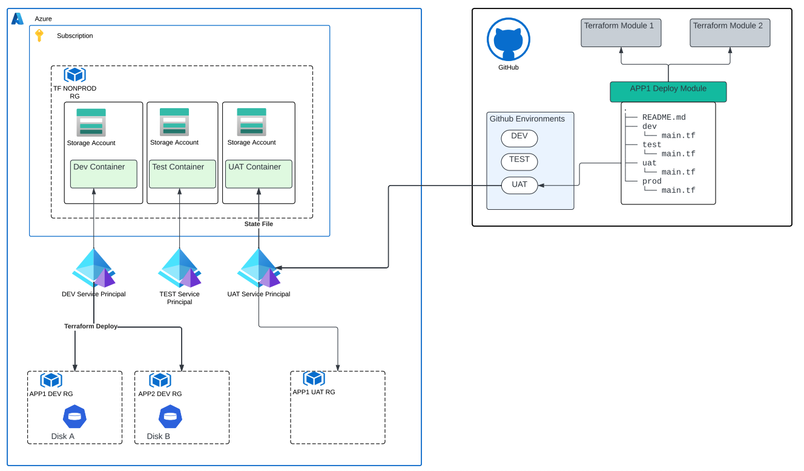

# AKS on Azure with Federated Github Actions

## Bootstrapping

** `modules/create-envs` **

First execute the `bootstrap.sh` file located in this module. This will create the initial Azure Blob storage to hold your Terraform state files. 

The module sets up the initial IAC resources in Azure. It should be executed by elevated account like Owner on a Subscription.

It sets up:
- storage accounts and containers for the environments listed in `envs`
- creates resource group for each environment
- creates AD service principals for each env

## Example
```
module "orgnamedev" {
  source      = "modules/create-envs"
  admin_email = "c4692bfd-7566-zzzz-yyyy-xxxxxxx"
  prefix      = "orgnamebe"
  envs        = ["dev", "qa"]
  mandatory_tags = {
    Appname      = "tfo",
    AppOwner     = "Fname Lname",
    CreationDate = ""
  }
}
```

** `modules/github-azure-federation` **

Once the bootstrap is complete, you setup github and azure federation. This is done through AD app federation.
Add all the repos you want to federate to the `repos` list. 
This will enable Github Actions for those repositories to be able to deploy to resource inside AKS without using static credentials.

## Example
```
module "add_repos" {
  github_org      = "gh-orgname"
  source          = "modules/github-azure-federation"
  azuread_app_ids = module.orgnamedev.azuread_app_ids
  repos = [
    "deploy-terraform-azure-orgname-aks",
    "deploy-terraform-azure-github-actions",
    "deploy-terraform-azure-another-repo"
  ]
}
```

The left side of the diagram shows the resources that are created by this module. 
 

## Deploying AKS

** `modules/aks` **
This module creates the AKS cluster and the associated resources. 
It also creates Container Registry and gives appropriate permission to pull and run containers from the registry.

## End to End Example

Look at the `bootstrap` directory on how to bootstrap and `dev` and `qa` directories for deploying AKS cluster.